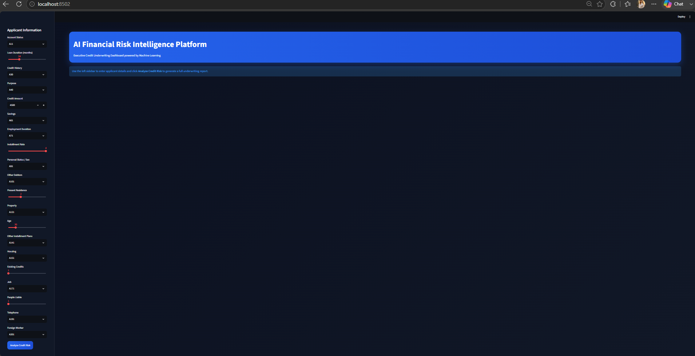
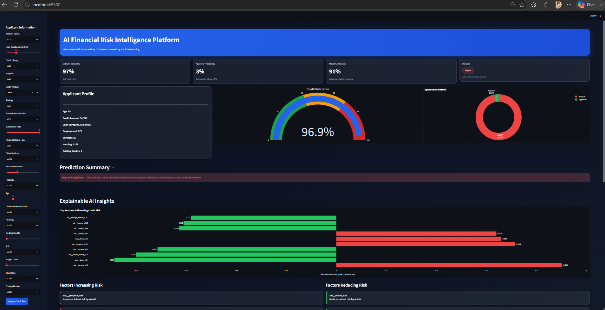
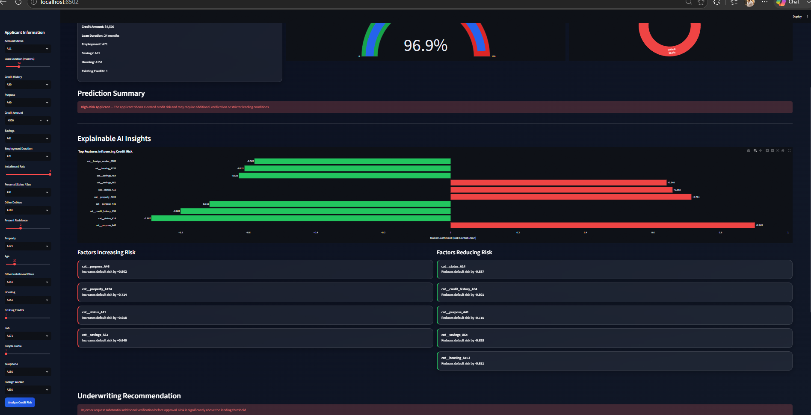
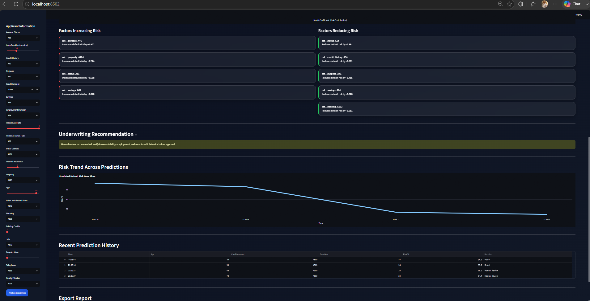
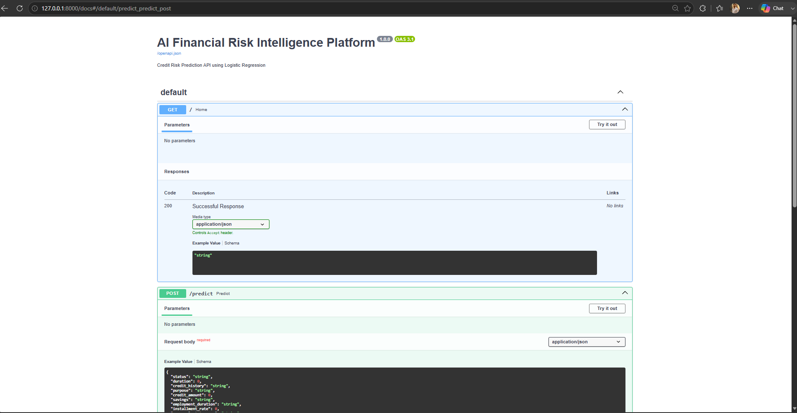

# AI Financial Risk Intelligence Platform


A production-style **machine learning application** that predicts **customer credit risk** using a trained Logistic Regression pipeline, exposes predictions through a **FastAPI REST API**, and provides an interactive **Streamlit underwriting dashboard** with explainable AI insights, risk analytics, and downloadable underwriting reports.

---

## Dashboard Preview

### Executive Dashboard



### Prediction Result



### Explainable AI Insights



### Risk Trend Analytics



### FastAPI Documentation



---

## Project Overview

Financial institutions evaluate multiple applicant attributes before approving a loan. This platform demonstrates a **real-world credit underwriting workflow**:

* Data preprocessing with `ColumnTransformer`
* Logistic Regression classification
* Probability-based risk scoring
* Explainable AI feature contribution analysis
* FastAPI prediction service
* Interactive Streamlit dashboard
* Dockerized deployment
* Automated testing with Pytest

The goal is to simulate a **production-ready fintech ML system** rather than a notebook-only machine learning project.

---

## Architecture

```text
                  User
                    |
                    v
          Streamlit Dashboard
                    |
                    v
             FastAPI REST API
                    |
                    v
        Scikit-learn Prediction Pipeline
                    |
                    v
   ColumnTransformer + Logistic Regression
                    |
                    v
             Credit Risk Prediction
```

---

## Features

* End-to-end machine learning pipeline
* Data preprocessing using `ColumnTransformer`
* Logistic Regression classifier
* FastAPI prediction endpoint
* Interactive Streamlit dashboard
* Executive KPI cards
* Credit risk gauge visualization
* Approval vs Default analytics
* Explainable AI using model coefficients
* Underwriting recommendation engine
* Risk trend tracking
* Prediction history
* CSV underwriting report export
* Docker deployment
* Pytest test suite

---

## Tech Stack

| Category      | Technology                  |
| ------------- | --------------------------- |
| Language      | Python                      |
| ML            | Scikit-learn, Pandas, NumPy |
| API           | FastAPI                     |
| Dashboard     | Streamlit                   |
| Visualization | Plotly                      |
| Testing       | Pytest                      |
| Deployment    | Docker, Docker Compose      |

---

## Project Structure

```text
AI_Financial_Risk_Intelligence_Platform/
├── app/
│   └── main.py
├── dashboard/
│   └── app.py
├── data/
├── models/
├── notebooks/
├── src/
│   └── models/
├── tests/
├── screenshots/
│   ├── dashboard-home.png
│   ├── prediction-result.png
│   ├── explainability.png
│   ├── risk-trend.png
│   ├── api-swagger.png
│   └── docker-running.png
├── Dockerfile
├── docker-compose.yml
├── requirements.txt
├── README.md
└── .gitignore
```

---

## Installation

### Clone the Repository

```bash
git clone https://github.com/yourusername/AI_Financial_Risk_Intelligence_Platform.git
cd AI_Financial_Risk_Intelligence_Platform
```

### Create a Virtual Environment

```bash
python -m venv .venv
```

### Activate Environment

**Windows**

```bash
.venv\Scripts\activate
```

**Linux / macOS**

```bash
source .venv/bin/activate
```

### Install Dependencies

```bash
pip install -r requirements.txt
```

---

## Running the Dashboard

```bash
streamlit run dashboard/app.py
```

Open:

```text
http://localhost:8501
```

---

## Running the API

```bash
uvicorn app.main:app --reload
```

API Base URL:

```text
http://127.0.0.1:8000
```

Swagger Documentation:

```text
http://127.0.0.1:8000/docs
```

---

## Docker Deployment

### Build

```bash
docker build -t credit-risk-api .
```

### Run

```bash
docker run -p 8000:8000 credit-risk-api
```

Or use Docker Compose:

```bash
docker compose up --build
```

---

## API Example

### Request

```http
POST /predict
```

```json
{
  
```
